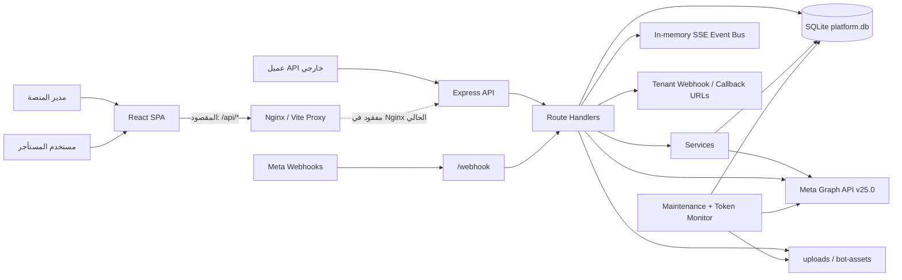
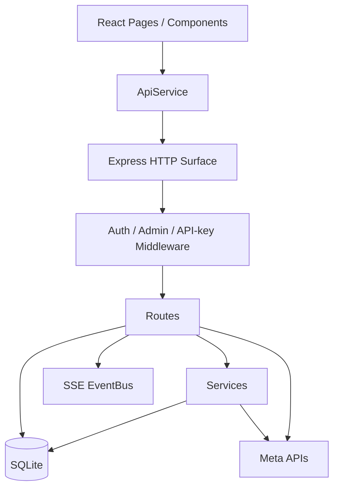
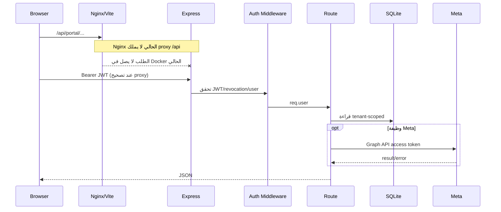
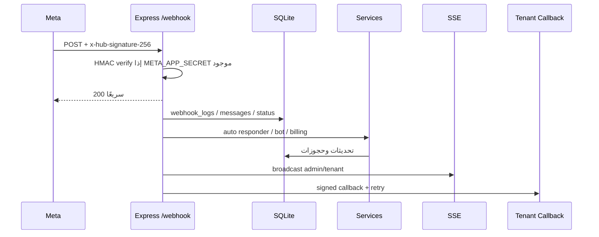
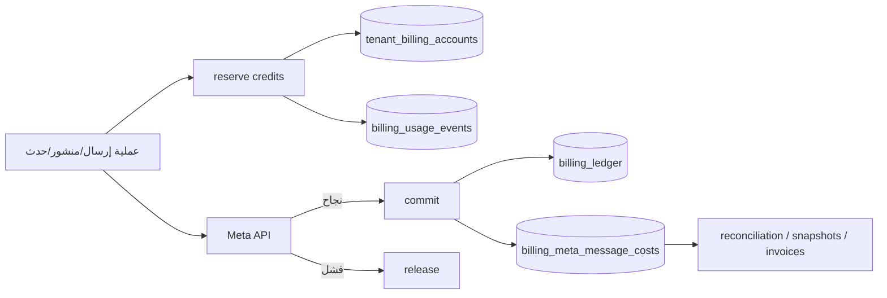
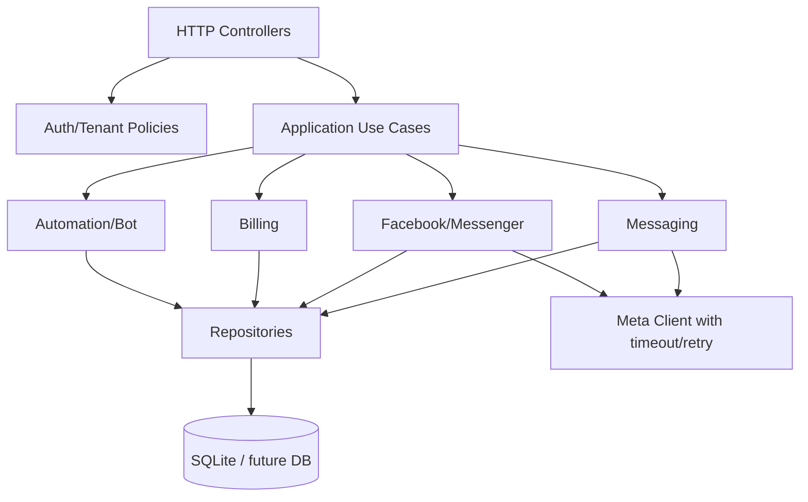

# خريطة معمارية مشروع Wa Savana

> **تحديث 2026-07-13:** الرسوم والتقييمات أدناه تحفظ خط الأساس وقت التدقيق. عولج عقد proxy والعزل المركزي والاختبارات والمراقبة، واستُخرجت Facebook content/insights والأتمتة وإعدادات API وجهات الاتصال والفوترة وdashboard من `tenantPortal.js`. راجع `AUDIT_SUMMARY.md` للحالة الحالية.

## النظرة العامة

النمط الفعلي هو SPA منفصلة عن REST API، مع طبقة خدمات داخل خادم Express وقاعدة SQLite واحدة. لا توجد طبقة application/domain مستقلة؛ معظم orchestration ومنطق الأعمال موزع بين route handlers وservices، وبعض منطق العرض والعمليات موجود داخل صفحات React الكبيرة.

## المشاريع والوحدات

| الوحدة | المسؤولية | أهم الاعتماديات |
|---|---|---|
| `client/src/App.jsx` | routing وRBAC للواجهة | AuthContext، React Router |
| `client/src/api/index.js` | transport/session/auth وSSE/media URLs وتركيب singleton المتوافق | Fetch، localStorage |
| `client/src/api/{portalCore,metaAdmin,operations,tenantFacebook,tenantMeta}.js` | calls مجمعة حسب مجال admin/tenant/Meta والتشغيل | transport المشترك عبر `this.request` |
| صفحات Admin | إدارة المنصة والمستأجرين وMeta والفوترة | API service، MUI |
| صفحات Tenant Portal | عمليات المستأجر المعزولة | API service، MUI |
| `server/server.js` | bootstrap، middleware، mounts، endpoints العامة، SSE | Express، DB، services |
| `server/routes/*` | validation وorchestration وHTTP responses | DB مباشرة وservices وMeta fetch |
| `server/routes/messengerBot.js` + وحدات `messengerBot{Summary,Products,Flows,Sessions,Shared}.js` | facade تركيبية وHTTP orchestration مجالي لملخص وكتالوج وتدفقات وجلسات البوت | DB محقونة، uploads، Messenger bot runtime |
| `server/routes/messages.js` + `messageSends.js` و`messageMedia.js` و`messageQueries.js` و`messageBroadcasts.js` و`messageContacts.js` و`messageReadReceipts.js` | composition facade لرسائل WhatsApp الإدارية مع حدود مستقلة للإرسال والوسائط والاستعلامات والبث وجهات الاتصال والتحقق وتعليم القراءة | DB/Meta/billing/eventBus محقونة في الوحدات المستخرجة؛ الوسائط تتحقق من tenant/phone/type/URL/window ونطاق تنزيل Meta وتضمن التنظيف والتسوية، والبث يفوض الدفعات إلى `broadcastProcessor.js` المشترك مع المستأجر، والتحقق مشترك، وإثراء fallback القالب يحترم DB الوحدة |
| `server/services/billing.js` + وحدات `billing*` المجالية | الحجز/الخصم/التحرير وMeta cost؛ core/math/period/history/analytics/rates/settings منفصلة | SQLite مباشرة في service الرئيسي؛ DB محقونة في period/history/rates/settings |
| `server/services/autoResponder.js` | مطابقة قواعد الأتمتة وإرسال الردود | DB، Meta API |
| `server/services/messengerBot.js` | runtime لتدفقات bot والمنتجات والجلسات | DB، Meta API |
| `server/services/credentials.js` | حل رموز Meta وفكها | encryption، DB، env |
| `server/services/encryption.js` | AES-256-GCM | `CRYPTO_KEY` |
| `server/services/eventBus.js` | بث SSE داخل عملية واحدة | Node EventEmitter |
| `server/db/migrator.js` | تطبيق SQL migrations وترقيمها | filesystem، SQLite |

## اتجاه الاعتماديات

الاتجاه العام واضح، لكن Routes تعتمد مباشرة على قاعدة البيانات وعلى Meta وعلى خدمات الأعمال، فتتحول إلى وحدات متعددة المسؤوليات. لا توجد circular imports مثبتة من فحص التشغيل، لكن coupling مرتفع جدًا بين `tenantPortal.js`, `billing.js`, `messages.js` والجداول.

## تدفق طلب واجهة عادي

## تدفق Webhook

خطر مهم: في Docker الحالي لا يُفرض `NODE_ENV=production`. إذا غاب `META_APP_SECRET` يواصل webhook قبول الطلبات دون signature بدل fail-fast.

## تدفق الفوترة

الفوترة تستخدم transactions/idempotency وتملك اختبارات math/period/history/invoice ودورة reserve/commit/release وتجميعات وأسعار وإعدادات Meta. بدأ تفكيكها إلى وحدات مجالية، لكن SQL لبقية التسعير وledger mutations والمطابقة ما زال شديد التعقيد داخل service رئيسي واحد.

## الوصول إلى البيانات

- اتصال singleton متزامن عبر `better-sqlite3`.
- `PRAGMA foreign_keys = ON` فقط؛ لا WAL ولا busy timeout.
- migrations تُطبق عند import قاعدة البيانات، قبل اكتمال startup validation.
- عزل المستأجر غالبًا predicates من نوع `WHERE tenant_id = ?` داخل كل handler.
- لا repository layer؛ SQL موزع في routes/services.

## التخزين والملفات

- رفع مؤقت إلى `server/uploads` بحد 16MB لمعظم الأنواع.
- `bot-assets` عام عبر Express static مع cache 30 يومًا.
- خط الأساس كان يعتمد على `file.mimetype`؛ طبقة الرفع الحالية تتحقق من magic bytes بسياسة route-specific وتطبع MIME/الامتداد قبل handler.
- تنزيل وسائط Meta يُحمّل الاستجابة كاملة في الذاكرة قبل إرسالها.

## الأخطاء والتسجيل

- error handler مركزي موجود، لكن معظم routes تمسك الأخطاء محليًا وتعيد 500.
- التسجيل إلى stdout فقط؛ لا structured logger ولا correlation ID ولا redaction policy موحدة.
- `webhook_failures` يعمل كـdead-letter مبسط.
- خط الأساس بلا metrics/tracing/alerting؛ حاليًا توجد JSON/Prometheus metrics وقواعد alert مجمعة، ويبقى tracing وتسليم Alertmanager خارجيين.

## تقييم المعمارية

| البعد | التقييم | الدليل |
|---|---|---|
| فصل الواجهة عن الخادم | جيد مفهوميًا، معطل تشغيليًا | proxy contract غير متطابق |
| فصل المجالات داخل Backend | ضعيف إلى متوسط | route files ضخمة وSQL مباشر |
| عزل المستأجر | مطبق غالبًا، غير مركزي | predicates متكررة وغياب tenant middleware |
| سلامة البيانات | متوسطة | FKs وفهارس جيدة، لكن قيود ناقصة وmigration فقدت بيانات |
| قابلية الاختبار | ضعيفة جدًا | لا tests ولا dependency injection |
| قابلية التوسع | ضعيفة | SQLite synchronous وSSE in-memory |
| التشغيل والمراقبة | ضعيفة | health سطحي، لا CI/CD/metrics |

## مناطق coupling والتكرار

- `tenantPortal.js` ما زال يجمع messaging، media، broadcast، templates، profile، analytics، QR، conversions، أجزاء Facebook/OAuth، وWhatsApp signup؛ خرجت منه content/insights/automation/API settings/contacts/billing/dashboard إلى routers مجالية.
- تشترك صفحات admin/tenant للأتمتة والقوالب وجهات الاتصال والبث ومحتوى Facebook في config/presentation مجالي؛ بقيت صلاحيات وAPI adapters منفصلة، وبعض orchestration الداخلي مرشحًا لاستخراج hooks لاحقًا.
- واجهة API ما زالت singleton واحدة للتوافق، لكن `index.js` صار transport facade عند 292 سطرًا وmethods المجالات موزعة على خمس وحدات؛ بقي توحيد upload/error helpers.
- منطق Meta fetch/response/error متكرر عبر routes كثيرة.
- منطق tenant ownership موزع بدل abstraction واحدة، ما يزيد احتمال IDOR عند إضافة endpoint جديد.

## الخريطة المستهدفة بعد التثبيت

لا يُنصح بتنفيذها قبل اختبارات العقد:

الهدف هو نقل orchestration تدريجيًا، لا إعادة كتابة endpoint surface دفعة واحدة.
